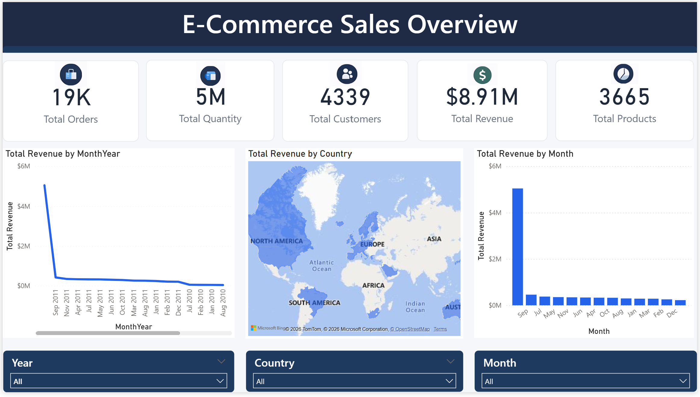
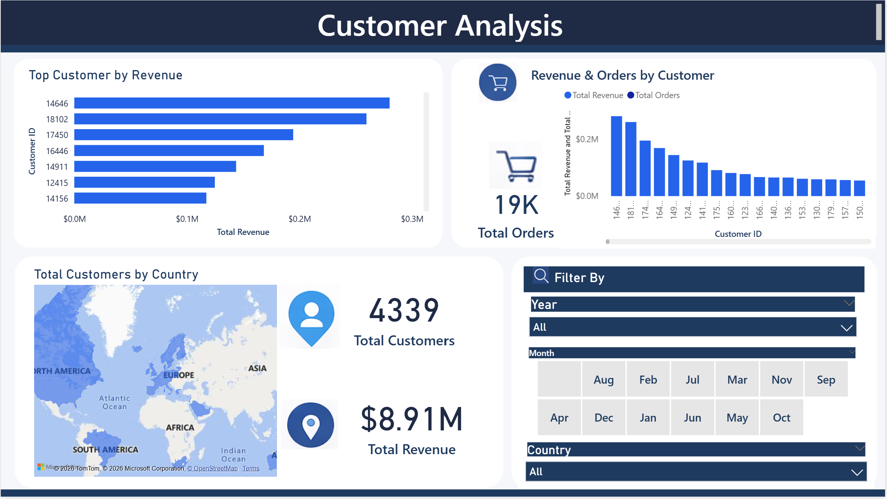
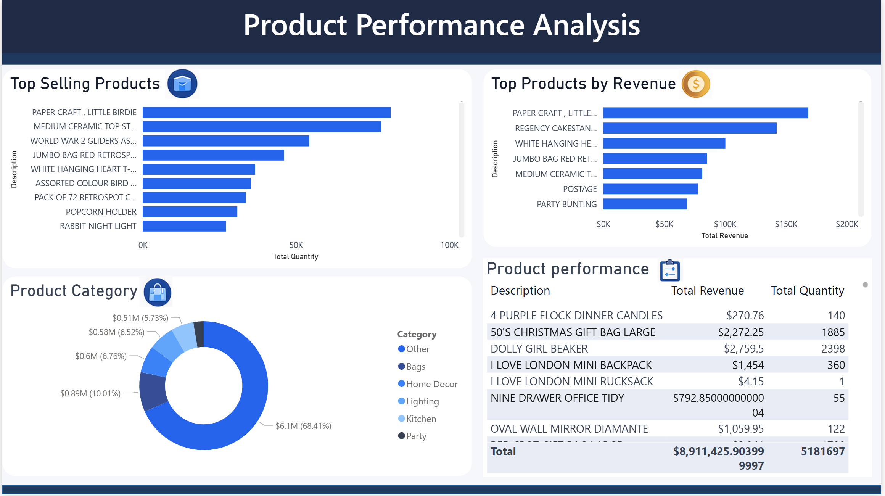

# E-Commerce Sales Analysis

## Project Overview
This project analyzes an E-commerce retail dataset to uncover insights about sales performance, customer behavior, and product trends.  
The analysis was performed using SQL, Python, and Power BI.

The goal of this project is to demonstrate data analysis skills including data cleaning, exploratory data analysis, business insight generation, and dashboard creation.

---

## Tools & Technologies
- SQL (Data Analysis Queries)
- Python (Pandas, Matplotlib)
- Power BI (Interactive Dashboard)

---

## Dataset
Dataset used in this project:

Online Retail Dataset

Source:
https://archive.ics.uci.edu/ml/datasets/online+retail

The dataset contains transactional data for an online retail store including:

- Invoice
- Product Description
- Quantity
- Invoice Date
- Price
- Customer ID
- Country

---

## SQL Analysis
SQL was used to analyze transactional data and generate key business insights.

Key SQL Analysis Performed:

- Total transactions
- Total customers
- Total products
- Total revenue calculation
- Revenue by country
- Top selling products
- Top customers by revenue
- Monthly sales trend
- Daily sales trend
- Product return analysis
- Average order value
- Average basket size

---

## Python Exploratory Data Analysis
Python was used for data exploration and visualization.

Libraries used:

- Pandas
- Matplotlib

Key Analysis:

• Data loading and initial exploration of the dataset  
• Calculation of product-level sales performance based on quantity sold  
• Identification of top revenue-generating customers  
• Country-level revenue analysis to understand geographic sales distribution 
• The United Kingdom contributes the largest share of total revenue, making it the primary market for the business.

 visualizations created in Python:

- Top 10 Selling Products
- Top 10 Customers by Revenue
- Revenue by Country

---

## Power BI Dashboard
Interactive dashboards were created using Power BI to visualize business insights.

Dashboard Pages:

1. Sales Overview Dashboard
2. Customer Analysis Dashboard
3. Product Performance Dashboard

---

## Key Business Insights

• The most sold product in the dataset is **PAPER CRAFT , LITTLE BIRDIE** with more than **80,000 units sold**, followed by **MEDIUM CERAMIC TOP STORAGE JAR** and **WORLD WAR 2 GLIDERS ASSTD DESIGNS**.

• A small group of customers generates a significant portion of revenue. The highest spending customer is **Customer ID 14646** with more than **£280,000 in total purchases**.

• Monthly revenue analysis shows strong growth during **2011**, with the highest revenue recorded in **September 2011**.

• Some transactions contain negative quantities which represent **product returns**, indicating the importance of monitoring return patterns. 

---

## Dashboard Preview

### Sales Overview Dashboard

### Customer Analysis Dashboard

### Product Performance Dashboard

---

## Project Skills Demonstrated

- Data Cleaning
- SQL Data Analysis
- Exploratory Data Analysis
- Data Visualization
- Business Insight Generation
- Dashboard Development

---

## Author
Himani Mehra
